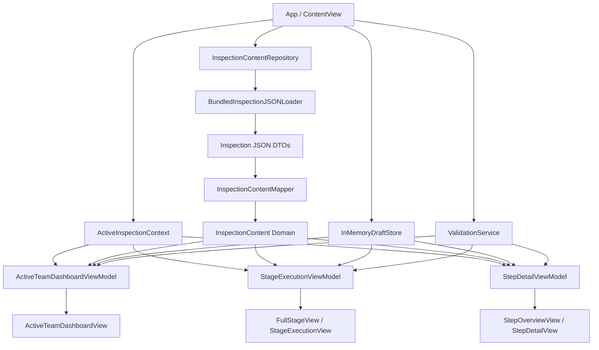
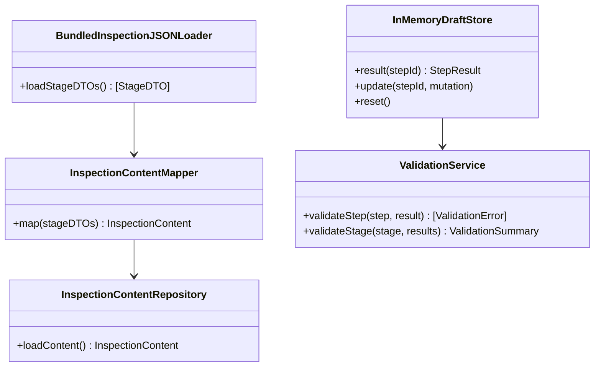
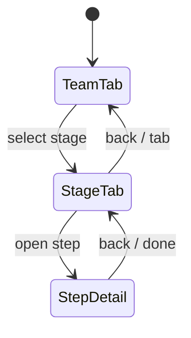

# Epic 1 Architecture Plan — One-Team Inspection Stages Workflow

This document is the architecture planning pass for Epic 1 before implementation begins. It turns the Epic task plan into model, service, view model, navigation, and test boundaries.

Sources:
- `Design/Architecture/InspectionEvents/PHASE4_MVVM_BLUEPRINT.md`
- `Design/Architecture/InspectionEvents/EPIC_IMPLEMENTATION_PLAN.md`
- `Design/Architecture/InspectionEvents/EPIC1_TASK_PLAN.md`
- `Design/UI/DESIGN_PROPOSAL.md`

## Architecture Goal

Epic 1 implements the core one-team inspection execution loop by replacing mock state in the current SwiftUI skeleton with domain-backed state, runtime draft editing, validation, and drill-in navigation.

The architecture should make Epic 2 and Epic 3 easier, not larger:
- Epic 1 uses one in-memory active team/session context.
- Epic 1 keeps draft edits process-local.
- Epic 1 uses stable identifiers and dependency boundaries that Epic 2 can persist and Epic 3 can later scope by `eventId + teamId + sessionId`.
- Epic 1 models evidence metadata only; actual attachment files are deferred.

## Current Architecture Baseline

Current app state:
- SwiftUI skeleton views exist for Session, Team, Stage, Step, and Team Switch flows.
- Active UI currently depends on `MockInspectionData`.
- Stage row edits are local `@State` inside the row, not shared domain state.
- Step detail edits are local `@State`, not synchronized with Stage.
- No bundled JSON loading exists in app code yet.
- No validation service exists yet.
- No navigation model exists beyond tab selection/screen enum.

Relevant current files:
- `FSAECertification/FSAEInspectionChecklist/FSAEInspectionChecklist/ContentView.swift`
- `FSAECertification/FSAEInspectionChecklist/FSAEInspectionChecklist/InspectionModels.swift`
- `FSAECertification/FSAEInspectionChecklist/FSAEInspectionChecklist/ActiveTeamDashboardView.swift`
- `FSAECertification/FSAEInspectionChecklist/FSAEInspectionChecklist/FullStageView.swift`
- `FSAECertification/FSAEInspectionChecklist/FSAEInspectionChecklist/StepOverviewView.swift`

## Target Architecture

## Model Boundaries

### Content Models

Content models are read-only inspection definitions loaded from bundled JSON.

Expected concepts:
- `InspectionContent`
- `InspectionStageDefinition`
- `InspectionSectionDefinition`
- `InspectionTestCaseDefinition`
- `InspectionStepDefinition`
- `InspectionStepType`
- `InspectionStepRules`
- `MeasurementRule`

Rules:
- Content models must not contain mutable draft state.
- IDs must be stable across app launches for the same bundled content.
- Ordering must come from `displayOrder`.

### Runtime Context Models

Runtime context models describe which event/team/session is active during this app process.

Expected concepts:
- `ActiveInspectionContext`
- `ActiveTeam`

Epic 1 context behavior:
- Created once at app startup.
- Represents exactly one team/session.
- Uses deterministic local values.
- Does not depend on Session Selector.
- Does not persist to disk.

Future Epic 2 diff:
- Persist and restore the deterministic one-team context across relaunch.
- Restore current stage and selected step from durable persistence.

Future Epic 3 diff:
- Replace the deterministic single context with selected/resumed `InspectionSession`.
- Scope context by real `eventId + teamId + sessionId`.

### Draft Models

Draft models represent mutable judge input during the current app process.

Expected concepts:
- `StepResult`
- `StepOutcome`
- `EvidenceMetadata`

Epic 1 evidence behavior:
- Evidence is metadata-only.
- A step can report evidence present/count/status for validation.
- No camera, picker, preview, binary file storage, or storage references are implemented in Epic 1.

Future Epic 2+ diff:
- Replace metadata-only evidence with durable attachment records if needed.
- Add file storage lifecycle in a dedicated architecture pass.

## Service Boundaries

Boundaries:
- `InspectionContentRepository` owns loading/mapping read-only inspection content.
- `InMemoryDraftStore` owns process-local mutable results only.
- `ValidationService` is stateless and deterministic.
- View models orchestrate services but do not parse JSON directly.

## View Model Boundaries

### `ActiveTeamDashboardViewModel`

Responsibilities:
- Expose active team header.
- Expose current stage.
- Expose stage rows.
- Expose dashboard summary.
- Navigate/select stage.

Important sequencing:
- Before draft state and validation exist, progress/blocker values are explicit baseline states: `0%`, `Not started`, or `Not evaluated`.
- Real progress/blockers are introduced only after draft state and validation are available.

### `StageExecutionViewModel`

Responsibilities:
- Expose selected stage header.
- Expose ordered editable step rows.
- Update draft results through `InMemoryDraftStore`.
- Surface validation errors.
- Calculate stage progress and submit-enabled state after validation exists.
- Emit step drill-in intent.

### `StepDetailViewModel`

Responsibilities:
- Expose one selected step.
- Read the same draft result used by Stage.
- Update the same draft result used by Stage.
- Surface validation for that one step.

## Navigation Architecture

Epic 1 keeps Team and Stage as primary tabs but adds explicit drill-in behavior.

Navigation requirements:
- Team -> Stage must preserve selected stage.
- Stage -> Step must preserve selected step.
- Step -> Stage must preserve draft edits.
- Stage -> Team must preserve process-local context and draft edits.

Open design choice for implementation:
- Use the existing `TabView` as the primary shell.
- Add `NavigationStack` path state for Step drill-in.
- Keep any future Session Selector and Team Switch screens inactive for Epic 1.

## Highlighted Diffs From Previous Architecture State

| Area | Previous State | Epic 1 Target | Deferred |
|---|---|---|---|
| App entry | Mock session/team/stage arrays in `ContentView` | One deterministic `ActiveInspectionContext` plus injected services | Real selected/resumed session |
| Content | Mock Swift arrays | Bundled JSON -> DTO -> domain content | Remote/content updates |
| Draft state | Local `@State` per row/view | Shared process-local draft store keyed by stable `stepId` | Durable draft storage |
| Validation | None | Stateless validation service, rule-by-rule | Server validation/analytics |
| Evidence | Mock UI attachments | Metadata-only evidence status/count for validation | File storage, camera/picker, preview |
| Dashboard progress | Mock progress values | Baseline first, then derived from draft + validation | Multi-session aggregation |
| Navigation | Tab/screen enum only | Team/Stage tabs plus Step drill-in/back flow | Session selector/team switch restore |
| Persistence | None | None for draft state in Epic 1 | One-team local persistence in Epic 2, multi-team session persistence in Epic 3 |

## Epic Boundaries

Epic 1 includes:
- Read-only bundled content loading.
- One active team/session context.
- Process-local draft state.
- Validation pipeline.
- Stage inline editing.
- Step drill-in editing.
- Back navigation for Team -> Stage -> Step.

Epic 1 excludes:
- Session selector as active app entry.
- Team switching.
- Durable draft persistence.
- Relaunch restore.
- Historical submissions.
- Re-submission.
- Attachment file storage and previews.

Epic 2 will include:
- One-team durable local draft persistence.
- One-team context restore after relaunch.
- Rehydrated validation and progress from persisted state.

Epic 3 will include:
- Session selector reactivation.
- Multiple team support.
- Save-before-switch confirmation.
- Context restore after team switching.
- State scoping by `eventId + teamId + sessionId`.

## Test Strategy by Planned Task PR

| Task PR | Architecture Slice | Test Strategy |
|---|---|---|
| PR 1.1 Decode Bundled Stage JSON | DTOs + JSON loader | Decode representative bundled files; verify ordering and required fields; verify deterministic failure behavior. |
| PR 1.2 Map DTOs to Domain Models | Domain content mapper | Verify stage/case/step ordering, stable unique IDs, and step type mapping. |
| PR 2.1 Define One Active Team Context | Runtime context | Verify deterministic team/session identifiers and no dependency on multi-team selection. |
| PR 2.2 Team Dashboard ViewModel | Read-only dashboard VM | Verify stage rows come from content; verify progress/blockers are baseline states before draft/validation. |
| PR 2.3 Connect Team View | Skeleton binding | Prefer VM tests; add view smoke checks only if existing test setup supports it. |
| PR 3.1 Step Result Model | Draft model | Verify default untouched state and mutation semantics. |
| PR 3.2 In-Memory Draft Store | Runtime draft store | Verify default read, update/readback by `stepId`, and step isolation. |
| PR 4.1 Required Verdict Validation | Validation rule | Verify missing verdict blocks; pass/fail/not-applicable satisfy the rule. |
| PR 4.2 Notes-on-Fail Validation | Validation rule | Verify fail without non-whitespace notes blocks; pass does not require notes. |
| PR 4.3 Measurement Validation | Validation rule | Verify missing, non-numeric, out-of-range, and valid measurement cases. |
| PR 4.4 Evidence Metadata Validation | Validation rule | Verify required metadata count blocks/clears; optional evidence does not block. |
| PR 4.5 Stage Validation Summary | Validation aggregate | Verify mixed step validation aggregates to blocker count and submit state. |
| PR 5.1 Stage Read Model | Stage VM read model | Verify selected stage row order and default draft values. |
| PR 5.2 Inline Verdict/Notes | Stage VM mutation | Verify draft updates and validation changes after verdict/notes edits. |
| PR 5.3 Inline Measurement | Stage VM mutation | Verify measurement draft updates and validation feedback. |
| PR 5.4 Inline Evidence Metadata | Stage VM mutation | Verify evidence metadata updates and validation feedback. |
| PR 5.5 Submit Gating | Stage VM aggregate | Verify submit disabled with blockers and enabled without blockers. |
| PR 6.1 Navigation Model | Navigation state | Verify Team -> Stage -> Step -> Stage state transitions and retained selection. |
| PR 6.2 Step Detail ViewModel | Step VM shared state | Verify Step detail reads and writes the same draft store as Stage. |
| PR 6.3 Connect Step Detail View | View binding | Verify shared draft consistency through view models; use UI smoke only if available. |
| PR 7.1 Active Flow Cleanup | Integration boundary | Verify active flow initializes without `MockInspectionData`. |
| PR 7.2 Epic Acceptance Pass | End-to-end behavior | Cover happy path and validation-blocked path at the highest practical test layer. |

## Implementation Handoff

Start implementation with:
- Branch: `codex/e1-m1-json-decoding`
- Base: `feature/epic-1-inspection-stages-workflow`
- Scope: PR 1.1 only.

PR 1.1 must not introduce:
- Domain draft state.
- Validation.
- View model rewiring.
- UI changes.
- Durable persistence.

PR 1.1 should produce:
- DTOs for bundled inspection JSON.
- A loader that can decode bundled stage files.
- Tests proving representative stage decoding and ordering.
