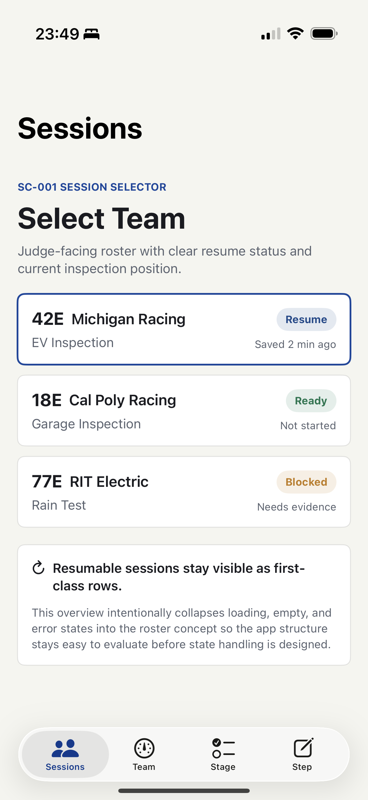
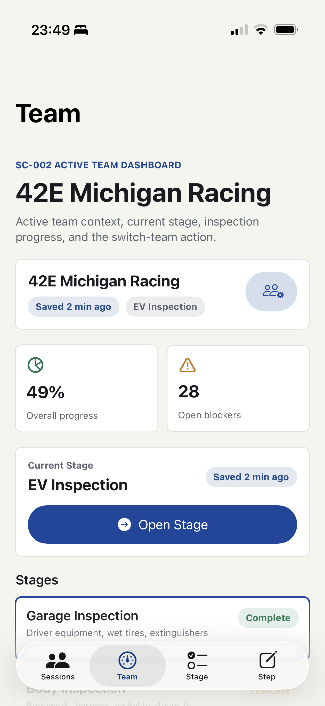
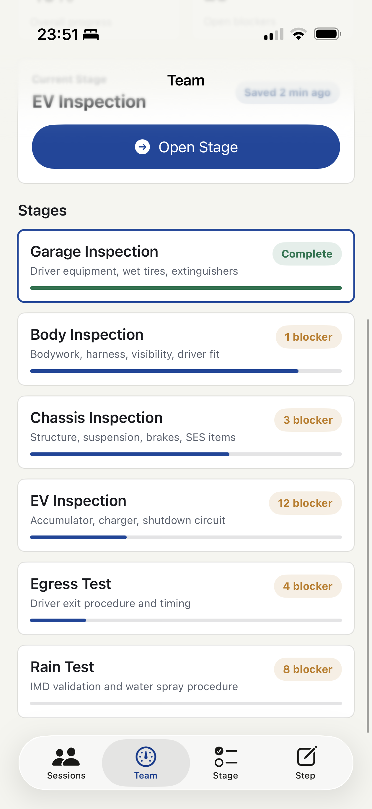
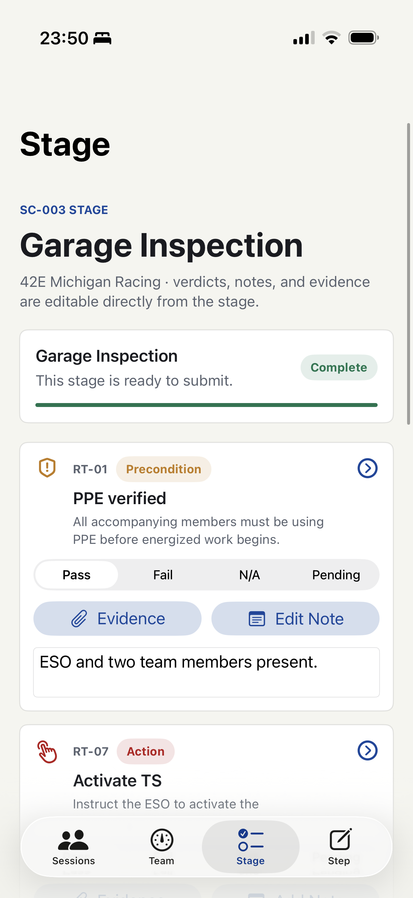
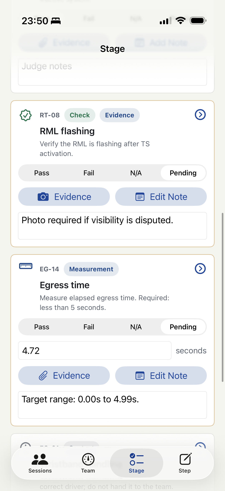
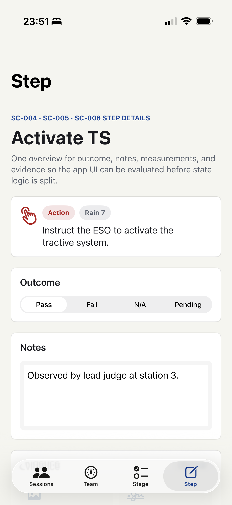
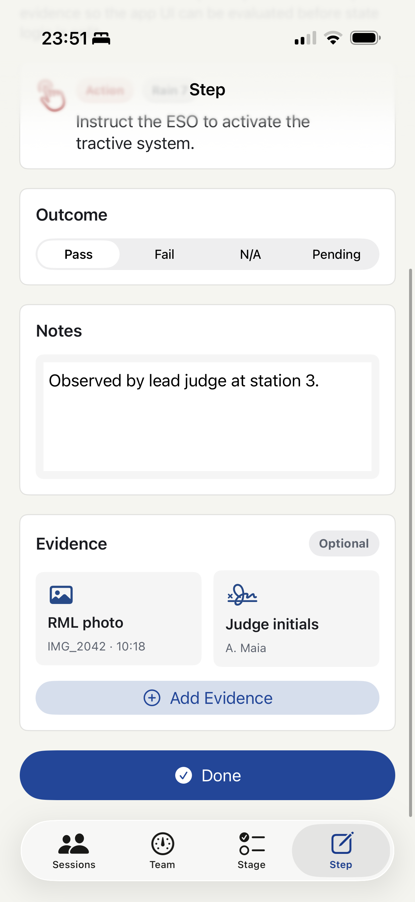
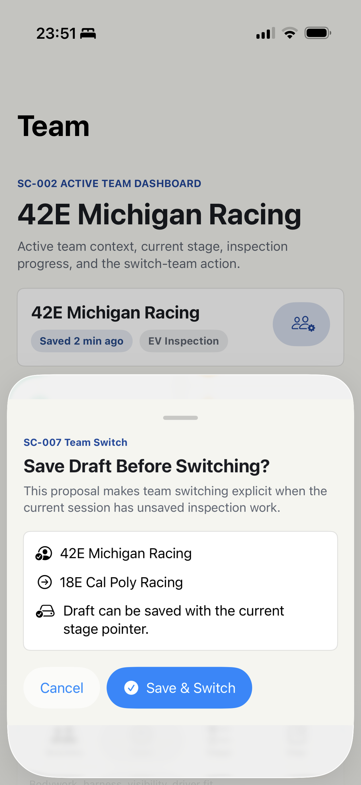

# Inspection Events UI Proposal

Current proposal state for the iOS inspection app UI. This proposal intentionally uses mocked inspection data and abstracts detailed loading, empty, validation, and persistence states so the team can evaluate the product shape first.

Scope:
- Includes `SC-001` through `SC-007` from `Design/Flows/InspectionEvents/PHASE3_SCREEN_MAP.md`.
- Excludes `SC-008` and `SC-009` history screens for now.
- Uses the dense Full Stage interaction as the app's primary `Stage` tab.
- Keeps the focused `Step` detail view as a drill-in destination from Stage.
- Uses blue as the primary brand/accent color; red is reserved for fail, required proof, and action/danger semantics.

Snapshot source:
- Screenshots in this document are manual simulator captures from the current SwiftUI proposal.
- Files live in `Design/UI/Snapshots` with the `manual-*` prefix.

## Navigation Model

The app proposal uses four primary tabs:

- `Sessions`: select or resume a team session.
- `Team`: show active team context, stage progress, blockers, and team switching.
- `Stage`: execute the current stage inline with verdicts, evidence, measurements, and notes.
- `Step`: focused step-level editing for judges who need more room or detail.

The `Stage` tab is the main work surface. A judge should be able to complete the common path without leaving it. The `Step` tab remains available through an explicit step-detail control on each stage row.

```swift
TabView(selection: $selectedScreen) {
    SessionSelectorView(...)
    ActiveTeamDashboardView(...)
    FullStageView(...)
    StepOverviewView(...)
}
```

## Visual System



The current proposal uses a light, high-contrast visual system:

- Primary accent: blue for navigation, selected borders, and active progress.
- Success: green for completed/pass states.
- Warning: amber for blockers and pending work.
- Danger: red for fail, required evidence, and energized/action semantics.
- Surfaces: white cards on a warm neutral background.

```swift
// Guidance
// Use primary blue for selection and navigation only.
// Do not use red as a brand color; reserve it for real inspection risk.
// Avoid adaptive .background surfaces in this proposal because dark mode can
// produce low-contrast screenshots unless every foreground is also explicit.
```

## SC-001 Session Selector


Purpose: select a team and create or resume its inspection session.

Current UI decisions:
- Team rows are the primary interaction target.
- Resumable sessions are clearly labeled.
- Each team shows car number, school, current stage, session status, and save state.
- The selected team row uses the primary blue outline.

```swift
// Guidance
// Keep this screen optimized for fast scanning at event check-in.
// Sort teams by active/resumable state first, then event roster order.
// Use status pills for "Resume", "Ready", and "Blocked".
// Selecting a row should move the judge to the active Team dashboard.
```

## SC-002 Active Team Dashboard





Purpose: show active team context and stage-level progress.

Current UI decisions:
- The team identity card is first and includes the switch-team action.
- Switch team is not placed at the bottom of the scroll.
- Stage progress bars remain visible and compact.
- Blocker language replaces "open" because it is more meaningful to judges.
- A completed stage appears with a green `Complete` status and full progress bar.

```swift
// Guidance
// Keep "Switch Team" visually close to the active team identity.
// Use "blocker" for stage gating counts.
// Show completed stages explicitly instead of relying on 100% progress alone.
// Tapping a stage should set selectedStage and navigate to the Stage tab.
```

## SC-003 Stage





Purpose: let judges execute a stage without unnecessary navigation.

Current UI decisions:
- This is the former Full Stage proposal, now promoted to the main `Stage` tab.
- Verdict controls are inline for each step.
- Evidence and notes actions are available directly on each step card.
- Measurement steps expose a value field inline.
- Each step card includes a detail affordance to open the focused `Step` view.

```swift
// Guidance
// The Stage tab should support the common judge workflow end to end:
// verdict, measurement, evidence, notes, and submit.
// Keep row controls compact but explicit.
// Make the step-detail affordance separate from editable controls so tapping
// a segmented verdict or text field does not accidentally navigate away.
// Use pending/boundary highlighting only for steps that block submission.
```

## SC-004 / SC-005 / SC-006 Step Detail





Purpose: provide a focused editing surface for one selected step.

Current UI decisions:
- Step detail combines outcome/notes, measurement, and evidence surfaces for the proposal.
- It is secondary to Stage, not the default execution path.
- The view is useful when a step has long text, complex evidence, or measurement validation.

```swift
// Guidance
// Keep Step as a drill-in destination from Stage.
// Preserve the selected step when navigating between Stage and Step.
// Use this view for richer validation messages, longer notes, attachment lists,
// and future evidence metadata editing.
// Return actions should preserve the judge's place in the stage checklist.
```

## SC-007 Team Switch Confirmation



Purpose: prevent accidental context loss when switching teams.

Current UI decisions:
- Team switch opens as a confirmation sheet.
- The copy emphasizes save-before-switch.
- The target team is shown before confirmation.
- The primary action is `Save & Switch`; cancel remains available.

```swift
// Guidance
// Show this sheet only when switching could affect unsaved draft work.
// Keep the current and target team visible in the confirmation.
// If draft save fails, keep the judge on the current team and surface retry.
// Successful confirmation should update active team context and return to Team.
```

## Implementation Notes

Current SwiftUI files:

- `FSAECertification/FSAEInspectionChecklist/FSAEInspectionChecklist/ContentView.swift`
- `FSAECertification/FSAEInspectionChecklist/FSAEInspectionChecklist/InspectionModels.swift`
- `FSAECertification/FSAEInspectionChecklist/FSAEInspectionChecklist/DesignSystem.swift`
- `FSAECertification/FSAEInspectionChecklist/FSAEInspectionChecklist/SessionSelectorView.swift`
- `FSAECertification/FSAEInspectionChecklist/FSAEInspectionChecklist/ActiveTeamDashboardView.swift`
- `FSAECertification/FSAEInspectionChecklist/FSAEInspectionChecklist/FullStageView.swift`
- `FSAECertification/FSAEInspectionChecklist/FSAEInspectionChecklist/StepOverviewView.swift`
- `FSAECertification/FSAEInspectionChecklist/FSAEInspectionChecklist/TeamSwitchConfirmationView.swift`

Build verification:

```sh
xcodebuild build \
  -quiet \
  -project FSAECertification/FSAEInspectionChecklist/FSAEInspectionChecklist.xcodeproj \
  -scheme FSAEInspectionChecklist \
  -destination generic/platform=iOS \
  -derivedDataPath /private/tmp/fsae-inspection-derived-data \
  CODE_SIGNING_ALLOWED=NO
```
