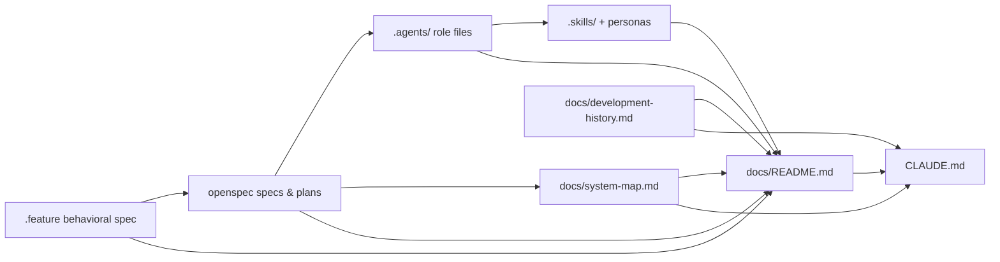

# Knowledge Base Index

This is the knowledge base for the FSAE Competition App — an offline-first iOS
SwiftUI (Swift 6) application for running Formula SAE technical inspection events,
backed by bundled JSON content and per-test-case JSON persistence. Its artifacts span
entry points, architecture docs, agent/skill role definitions, OpenSpec specs and
plans, SPDD task prompts, and an executable behavioral spec.

The organizing principle is **minimum context**: read only what the task in front
of you needs. Every task type below maps to a short reading list (see
[Reading paths](#reading-paths)) — you should not need to read the whole tree to
make a change. Artifacts declare their dependencies explicitly via
[doc hooks](#doc-hooks), so you can follow the graph from any starting point to the
few documents that actually matter.

## Artifact tree

Grouped by ROLE, not by directory. Each leaf carries a one-line purpose.

```
Entry points
  CLAUDE.md ............................ Claude Code guidance: build/test commands, MVC-with-coordinators
                                          architecture, conventions, agent workflow, KB index (no frontmatter)
  README.md ............................ User-facing overview of the FSAE Inspection Checklist app,
                                          the 6 inspection stages, and doc links (no frontmatter)

Architecture & app docs
  docs/system-map.md ................... iOS navigation flow: 3-level coordinator hierarchy, screen
                                          inventory, state-driven presentation
  docs/inspection-event/README.md ...... Technical overview: Models/Views/Coordinators/Services, recheck
                                          behavior, testing, accessibility & localization conventions
  docs/inspection-event/tutorials.md ... How to extend: add inspection JSON fixtures, validation rules,
                                          a11y identifiers, persona scenarios
  docs/inspection-event/review-hygiene.md  PR description sections, branch rules, commit conventions,
                                          squash-merge guidance
  docs/inspection-event/organization-plan.md  Source directory layout: target tree, dry-run move table,
                                          applied organization pass, organization rules

Agents & skills
  .agents/architect.md ................. Architect role: MVC design, model/coordinator/service boundaries,
                                          source-of-truth ownership review
  .agents/planner.md ................... Planner role: sequence work into feature slices, branch naming,
                                          task-sized commits, PR descriptions
  .agents/developer.md ................. Developer role: implement slices in Swift 6 / SwiftUI with TDD,
                                          accessibility, localization
  .agents/tester.md .................... Tester role: strategy via personas, feature scenarios, TDD, UI &
                                          snapshot tests
  .agents/documenter.md ................ Documenter role: technical docs with YAML frontmatter, tutorials,
                                          PR validation notes (owner of this index)
  .skills/personas.md .................. Personas skill: priority Judge/Student personas, secondary
                                          Professor/Fans/Sponsors, workflow, expected outputs
  .skills/accessibility.md ............. Stable identifiers, VoiceOver completion, contrast, non-color cues
  .skills/concurrency-developer.md ..... Actor isolation, async services, Sendable models, main-actor UI
                                          boundaries
  .skills/swiftui-developer.md ......... Composable views, structured Strings enums, previews, a11y modifiers
  .skills/architecture-developer.md .... MVC structure, folder organization, model & service boundaries
  .skills/animation-developer.md ....... Small accessible animations for outcome/pass-fail/state changes
  .skills/personas/judge.md ............ Judge persona (primary): inspection judge during a busy event
  .skills/personas/student.md .......... Student persona (primary): team member needing inspection feedback
  .skills/personas/professor.md ........ Professor persona (secondary): advisor reviewing traceability/history
  .skills/personas/fans.md ............. Fans persona (secondary): spectator viewing public status
  .skills/personas/sponsors.md ......... Sponsors persona (secondary): reliable/fair event status view

Specs & plans   (openspec/changes/technical-inspection-event-development-plan/)
  proposal.md .......................... Why/what-changes/impact for the inspection-event development plan
  design.md ............................ Architecture decisions: MVC, core classes, actor isolation,
                                          persistence, bundled-JSON strategy
  tasks.md ............................. Task breakdown across 11 phases (planning → parking lot) with
                                          per-phase checklists
  specs/inspection-event-execution/spec.md .............. Judge flow: login → active session → stage/case/
                                          step inspection → validation → submission → recheck
  specs/inspection-event-json-content/spec.md ........... Bundled JSON: offline stage content, decoding,
                                          malformed-content handling, incremental development
  specs/inspection-event-accessibility-localization/spec.md  Stable a11y IDs, VoiceOver completion,
                                          color/contrast, localizable string constants
  specs/inspection-event-testing-strategy/spec.md ....... TDD coverage: unit/UI/snapshot tests, feature-
                                          scenario mapping, UI automation

Task prompts   (docs/prompts/tasks/ — folder-level; SPDD 7-step chains 01-requirements..07-safeguards)
  docs/prompts/tasks/README.md ......................................... Prompt-run taxonomy: tentpoles &
                                          macro-tasks (~1 index file)
  docs/prompts/tasks/TASK-5-test-case-slice/ ........................... Test case domain + view (~7 files)
  docs/prompts/tasks/TASK-6-test-case-list-and-stage-slice/ ............ Stage content & rendering (~7 files)
  docs/prompts/tasks/TASK-7-session-submission-and-recheck-flow/ ....... Session lifecycle & persistence
                                          (~7 files + operations-summary)
  docs/prompts/tasks/TASK-8-dedicated-ui-test-and-snapshot-pr/ ......... UI automation & snapshots
                                          (~7 files + operations-summary)
  docs/prompts/tasks/TASK-9-documentation-and-review-hygiene/ ......... Docs & PR hygiene
                                          (~7 files + operations-summary)
  docs/prompts/tasks/TASK-10-local-stored-judge-experience-ux-follow-up/  Judge UX, rechecks, stickers
                                          (~7 files)
  docs/prompts/tasks/TASK-12-spdd-2026-06-29-tentpoles/ ............... Tentpole prompt reorganization
                                          (~7 files + operations-summary)
  Tentpoles (organizing themes across the folders above):
    0 test-step/case/stage/session/submission foundation · 1 persistence & ModelActor migration
    2 local stored judge UX · 3 organization/docs/hygiene · 4 dedicated UI automation

Behavioral spec
  Design/UserStories/InspectionEvents/features/inspection_event_use_cases.feature
                                          Gherkin acceptance spec: start/resume session (US-001/005),
                                          stage submission & validation (US-002/003/004), team switching
                                          (US-006), immutable history (US-007), offline stage data

History
  docs/development-history.md .......... How the app was built (Jun–Jul 2026): timeline reconstructed from
                                          git reflog, OpenSpec phases, and SPDD prompt runs
```

## Doc hooks

Every long-lived doc carries a `doc_hooks:` block in its YAML frontmatter with two
lists of **repo-relative paths**:

- **`upstream`** — what this doc *derives from*. These are its sources of truth:
  code files, specs, other docs, or git history. If an upstream artifact changes,
  this doc may be stale and should be re-checked.
- **`downstream`** — what *consumes* this doc. These are the artifacts that point
  back to it as an upstream. If you edit this doc, its downstream consumers may need
  updating.

The convention is directional and reciprocal: if doc A lists B as `downstream`,
then B should list A as `upstream`. Edges below are drawn **upstream --> downstream**
(the source of truth points to its consumer).



## Reading paths

Each task type lists only the 2–4 documents to read — deliberately. Resist reading
past the list unless a doc hook sends you somewhere specific.

- **Onboarding** — `CLAUDE.md`, `README.md`, `docs/system-map.md`.
- **Implementing a feature slice** — `docs/system-map.md`,
  `.agents/developer.md`, the relevant
  `openspec/changes/.../specs/inspection-event-execution/spec.md`, and the matching
  `docs/prompts/tasks/TASK-*/` chain.
- **Writing/using tests** — `.agents/tester.md`,
  `openspec/changes/.../specs/inspection-event-testing-strategy/spec.md`,
  `Design/UserStories/InspectionEvents/features/inspection_event_use_cases.feature`.
- **Changing navigation** — `docs/system-map.md`, `.agents/architect.md`,
  `.skills/swiftui-developer.md`.
- **Understanding project history** — `docs/development-history.md`,
  `openspec/changes/technical-inspection-event-development-plan/tasks.md`.
