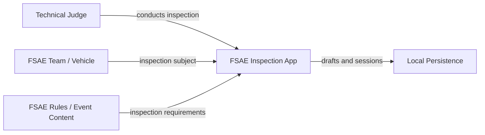
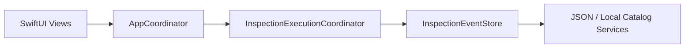

# Architecture Overview

This document provides the shortest useful mental model of the current FSAE Inspection Checklist system: why it exists, who participates, which business transactions matter, and which code boundaries carry those responsibilities.

Use this document before the more detailed [system map](system-map.md). The system map explains runtime navigation, screens, coordinators, modules, risks, and known implementation gaps in greater depth.

## Purpose

The FSAE Inspection Checklist turns Formula SAE Electric Vehicle technical inspection rules into a structured, offline judge workflow that produces traceable inspection records for each team and inspection session.

The core business loop is:

**Select Team → Inspect → Record → Validate → Persist → Complete**

The product's value is not simply presenting a checklist. It creates a consistent digital record of a physical technical inspection while preserving judge decisions, measurements, evidence metadata, validation state, and team progress throughout an event.

## Core Business Value

The system helps technical judges:

- perform the official inspection stages in a consistent order;
- associate inspection work with the correct event, team, session, and stage;
- record pass/fail/N/A outcomes, notes, measurements, and evidence metadata;
- identify blockers before an inspection can be considered complete;
- preserve in-progress work locally without relying on network availability; and
- resume a team inspection without losing the inspection context.

## System Context

### Primary actor: Technical Judge

The Technical Judge is the primary application user. The judge selects or resumes a team session, opens inspection stages, performs test cases, records test-step outcomes, resolves validation blockers, and completes inspection work.

### Primary business subject: FSAE Team / Vehicle

The FSAE Team / Vehicle is the subject of the inspection rather than a direct application operator in the current implementation. Inspection records are scoped to a team, but actions are performed by the judge.

### Supporting actors and systems

- **Event administration / team catalog** supplies event and team identity used to scope inspection sessions.
- **FSAE inspection rules and bundled content** define the stages, test cases, steps, rule references, and validation expectations presented to the judge.
- **Local device persistence** stores team catalogs, session catalogs, and draft inspection data so the workflow remains usable offline.



## Main Business Transactions

### 1. Start or Resume a Team Inspection

**Actor:** Technical Judge

**Input:** event and team selection.

**Result:** the application restores an active session or creates a new inspection session, establishes the current team/stage context, and routes the judge to the team dashboard.

### 2. Open Inspection Work

**Actor:** Technical Judge

**Input:** stage, test-case, or test-step selection.

**Result:** the active inspection context and Stage navigation path move to the requested work while preserving the current team session.

### 3. Record an Inspection Result

**Actor:** Technical Judge

**Input:** test-step outcome plus optional notes, measurement, and evidence metadata.

**Result:** the current `TestCaseDraft` is updated with the edited `TestStepDraft`.

### 4. Validate and Persist Inspection Progress

**Actor:** Application

**Input:** updated test-case draft and inspection session scope.

**Result:** the draft is written to local persistence, session save metadata is updated, and progress/blocker state is derived from the latest drafts.

### 5. Complete Inspection Work

**Actor:** Technical Judge

**Input:** completion action after required inspection work has no blocking validation failures.

**Result:** the inspection session transitions to its completed/submitted state.

> **Current implementation note:** stage-level submission is not yet fully wired. `FullStageView` exposes a validation-gated Submit Stage action, but `ContentTabsView` currently passes an empty `submitStage` closure. `SubmissionSnapshotService` exists but is not connected to that action yet.

## Architecture Spine

The shortest code path from user intent to durable inspection state is:



### `AppCoordinator.swift`

Owns application-level routing and exposes the main commands used by the UI, including team selection, stage/test-case/test-step navigation, draft saving, and session completion.

### `InspectionExecutionCoordinator.swift`

Owns the live inspection state for the active session: active team/stage/test case/test step, Stage navigation path, drafts grouped by stage, blocker counts, completion eligibility, draft restoration, and draft saves.

### `InspectionEventStore.swift`

Defines the domain repository boundary for events, teams, sessions, access checks, local team/session catalogs, and test-case draft persistence.

Together these three files answer most first-order questions about how a judge action becomes stored inspection state.

## Three Files to Read First

For a new contributor trying to understand the implementation quickly, read in this order:

1. `Features/SessionFlow/Coordinators/AppCoordinator.swift`
2. `Features/SessionFlow/Coordinators/InspectionExecutionCoordinator.swift`
3. `Features/SessionFlow/Store/InspectionEventStore.swift`

Then read `App/ContentTabsView.swift` to see how SwiftUI surfaces those commands through the Sessions, Team, and Stage landmarks.

All four paths above are relative to:

`FSAECertification/FSAEInspectionChecklist/FSAEInspectionChecklist/`

## Domain Scope

Inspection work is scoped by the following hierarchy:

```text
Event
└── Team
    └── Inspection Session
        └── Stage
            └── Test Case
                └── Test Step
```

Durable draft persistence is explicitly scoped by:

**event → team → session → stage**

The test-case identifier then selects the draft within that scope.

## Architecture Invariants

These invariants describe business and architecture behavior that should remain true even if UI or persistence implementation changes:

1. **A judge acts on one active team inspection session at a time.**
2. **Inspection data is scoped by event → team → session → stage.**
3. **Test-step edits update a test-case draft before persistence.**
4. **Draft persistence must not require network availability.**
5. **Validation derives from inspection content plus current draft state.**
6. **UI navigation is not the source of truth for inspection data.**
7. **The team is the inspection subject, not currently an authenticated application operator.**
8. **Current-state documentation must distinguish implemented behavior from design-only behavior.**

## Documentation Boundaries

Use the repository documentation with this convention:

- **`docs/` describes the current system**: implemented runtime behavior, architecture, workflows, risks, and operational guidance.
- **`Design/` contains proposed or historical design work**: architecture plans, screen maps, flows, and implementation proposals that may be partially implemented or superseded.

When these disagree, prefer current source code and `docs/` for statements about what the application does today, and treat `Design/` as intent or design history unless explicitly marked otherwise.

## Related Documentation

- [Current system map](system-map.md) — runtime flow, screens, coordinators, modules, risks, and known gaps.
- [Inspection event technical overview](inspection-event/README.md) — detailed inspection-event documentation.
- [Inspection event tutorials](inspection-event/tutorials.md) — task-oriented inspection-event guidance.
- [Review hygiene and PR rules](inspection-event/review-hygiene.md) — review expectations and repository hygiene.
- [Tentpole 3 organization plan](inspection-event/organization-plan.md) — current organization plan for inspection-event work.
