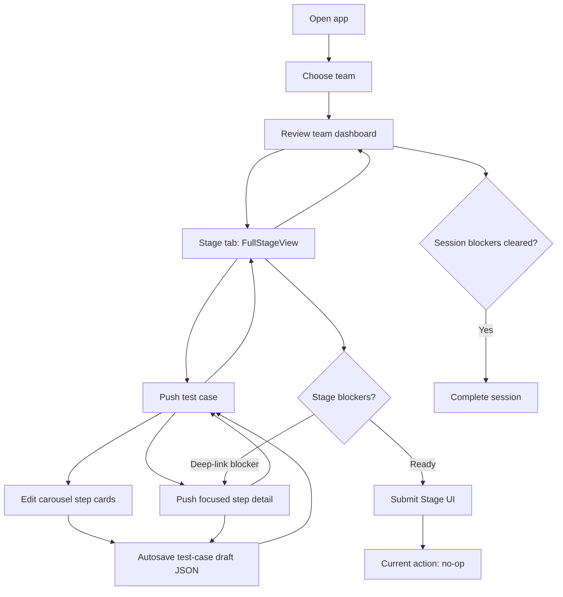

# System Map: Judge Inspection Flow

This document maps the judge-facing inspection journey first, then summarizes the
SwiftUI coordinator, navigation, persistence, and validation wiring that supports it. App source root:
`FSAECertification/FSAEInspectionChecklist/FSAEInspectionChecklist/` (all
repo-relative paths below are relative to this root unless prefixed).

For the business value, actor model, transaction model, architecture invariants,
and shortest code-reading path, start with the [Architecture Overview](architecture-overview.md).

## System Context

The primary human actor is the **Technical Judge**. The primary business subject is
the **FSAE Team / Vehicle**: inspection work is recorded against a team, but the
team is not currently modeled as an application operator.

The system converts observations from a physical technical inspection into
structured records associated with:

- event;
- team;
- judge;
- inspection session;
- stage;
- test case; and
- test step.

Bundled FSAE inspection content supplies the requirements and rule references.
Local persistence supports team/session catalogs and in-progress drafts so the
judge workflow does not depend on network availability.

## Business Transactions

The current judge workflow is built around five business transactions:

1. **Start or resume a team inspection.** The judge selects a team and the app
   restores an active session or creates a new one.
2. **Open inspection work.** The judge selects a stage, test case, or test step and
   the active inspection/navigation context moves to that work.
3. **Record an inspection result.** A test-step outcome plus optional notes,
   measurement, and evidence metadata updates the containing `TestCaseDraft`.
4. **Validate and persist progress.** Draft-backed validation derives blockers and
   progress while `InspectionEventStore` persists the scoped test-case draft and
   updates session save metadata.
5. **Complete inspection work.** Session completion transitions the active session
   to its submitted/completed state once blocking validation is resolved.

Stage submission is a separate UI concept and is **not yet a completed business
transaction**: the validation-gated control exists, but `ContentTabsView` currently
passes an empty `submitStage` closure and does not call `SubmissionSnapshotService`.

## User Flow Overview

A judge launches the app, selects or resumes a team session, reviews the active
team dashboard, works through inspection stages, records test-step outcomes, and
resolves validation blockers. Test-case edits are persisted locally as drafts.

Primary implemented path:

1. Launch app.
2. Select or resume a team session.
3. Review team progress and open a stage.
4. Open an inspection stage.
5. Push into a test case inside the Stage tab.
6. Record step outcomes, measurements, evidence, and notes inline, or push into a focused step detail.
7. Persist each edited test-case draft and update blocker/progress state.
8. Resolve blockers until the stage is eligible for submission.
9. Return to the team dashboard and complete the active session when session-level blockers are cleared.

The Stage UI also exposes a **Submit Stage** control, but its action is currently a
no-op. Team switching has UI/coordinator scaffolding, but
`InspectionExecutionCoordinator.requestTeamSwitch` is currently disabled and
returns `false`.

## Judge Flow Diagram

## Screen Responsibilities

| User goal | Screen | What the judge can do |
| --- | --- | --- |
| Pick inspection work | SessionSelectorView (Sessions tab) | Select or resume a team session; blocked teams stay on the roster. |
| Understand team progress | ActiveTeamDashboardView (Team tab) | Review stage status, open blockers, continue a stage, or complete the session when eligible. |
| Work a stage | FullStageView (Stage tab root) | Open test cases, review validation blockers, and see the validation-gated Submit Stage control. |
| Complete a case | TestCaseView (pushed inside Stage tab) | Edit all step outcomes, notes, measurements, and evidence for a test case through horizontally paged step cards. |
| Focus one step | StepOverviewView (pushed inside Stage tab) | Record a single step result, then return to the active test case. |
| Confirm team switch | TeamSwitchConfirmationView (sheet) | UI for confirming a pending switch; the current execution coordinator disables switch requests. |

## Current Gaps

- `FullStageView` renders a **Submit Stage** button gated by draft-backed
  validation (`FullStageViewState.canSubmit`), but the `submitStage` closure wired
  in `ContentTabsView` is currently an empty no-op.
- `SubmissionSnapshotService` can create immutable stage/test-case snapshot files,
  but it is not connected to the Stage tab submit action yet.
- `InspectionExecutionCoordinator.requestTeamSwitch` currently returns `false`, so
  the team-switch UI/coordinator scaffolding is not an active workflow.
- Recheck and sticker eligibility screens are specified in
  `openspec/changes/technical-inspection-event-development-plan/design.md` but are
  not implemented in navigation yet.
- Validation is not a separate screen: it renders inline as
  `FullStageValidationPanel` and `TestCaseValidationSummaryPanel`, then deep-links
  blockers to the relevant step.
- Test case cards currently autosave inline draft changes, but the focused step
  detail still owns a separate notes/evidence surface. Keep both paths in sync when
  changing draft semantics or accessibility identifiers.

## Implementation Map

The app is a single-window SwiftUI app (`FSAEInspectionChecklistApp` ->
`ContentView`) whose root UI is a three-tab `TabView` (`ContentTabsView`):
**Sessions**, **Team**, **Stage**. Sessions and Team are top-level
`NavigationStack`s. The Stage tab owns the in-inspection push stack:
`FullStageView` -> `TestCaseView` -> `StepOverviewView` through
`InspectionExecutionCoordinator.stageNavigationPath`.

Navigation is owned by a three-level coordinator hierarchy (MVC + Coordinators,
per the development plan design):

1. **`AppCoordinator`** (root) holds `route: AppCoordinatorRoute` (`.login` /
   `.sessionSelector` / `.inspection`) and `selectedScreen: ProposedScreen`.
   In the current UI, only the top-level landmarks
   (`.sessionSelector`, `.dashboard`, `.stageChecklist`) select visible tabs.
   Test case and step routes stay inside the Stage tab navigation path.
   `selectedScreen` is bound to the `TabView` selection via
   `ContentViewBindings.selectedScreenBinding`, so setting it changes the visible
   screen. Login is mocked: `ContentView.task` calls `completeMockLogin()` on
   launch and then loads official stages through `InspectionContentService`,
   falling back to `MockInspectionData`.
2. **`InspectionEventCoordinator`** scopes the inspection event: it owns a
   `SessionSelectionCoordinator` and creates a fresh
   **`InspectionExecutionCoordinator`** whenever a session is started or resumed,
   restoring persisted drafts from the `InspectionEventStore`.
3. **`InspectionExecutionCoordinator`** holds the in-session position as
   `stageNavigationPath: [StageNavigationRoute]` and draft state grouped by stage
   (`draftsByStageID`). Views call closures that funnel into `AppCoordinator`
   methods such as `openStage`, `openTestCase`, `openTestStep`, and
   `saveStepDraft`. Team-switch state is also modeled, but switch requests are
   currently disabled in the execution coordinator.

State-driven presentation: tabs whose coordinator state is missing (no execution
coordinator or no active stage) render an `EmptyFlowState` placeholder instead of
their screen. A team-switch confirmation `.sheet` remains hosted by `ContentView`,
with presentation derived from coordinator pending-switch state.

Persistence is local and test-case scoped. `InspectionExecutionCoordinator` loads
draft files for the active stage through `InspectionEventStore`, saves each edited
`TestStepDraft` into a `TestCaseDraft`, and delegates JSON storage to
`TestCaseJSONPersistenceService`. `SubmissionSnapshotService` can materialize
submitted test-case and stage snapshot files, but no screen currently calls it.

## Screen Inventory

| Screen | Owning coordinator | Source file (repo-relative) | Purpose |
| --- | --- | --- | --- |
| ContentTabsView (root tabs) | `AppCoordinator` | `FSAECertification/FSAEInspectionChecklist/FSAEInspectionChecklist/App/ContentTabsView.swift` | Root three-tab `TabView`; binds top-level tab selection to `AppCoordinator.selectedScreen` and hosts Stage tab push navigation. |
| SessionSelectorView (SC-001) | `SessionSelectionCoordinator` | `FSAECertification/FSAEInspectionChecklist/FSAEInspectionChecklist/Features/SessionFlow/Views/SessionSelectorView.swift` | Judge-facing team roster with resume status; tapping a team starts or resumes its inspection session. |
| ActiveTeamDashboardView (SC-002) | `InspectionExecutionCoordinator` | `FSAECertification/FSAEInspectionChecklist/FSAEInspectionChecklist/Features/SessionFlow/Views/ActiveTeamDashboardView.swift` | Active team context: overall progress, open blockers, draft-backed per-stage status rows, stage navigation, and session completion. |
| FullStageView (SC-003 Stage) | `InspectionExecutionCoordinator` (via `AppCoordinator` closures) | `FSAECertification/FSAEInspectionChecklist/FSAEInspectionChecklist/Features/StageExecution/Views/FullStageView.swift` | Ordered sections and test cases for the active stage, stage validation panel with blocker deep-links, and the currently unwired validation-gated Submit Stage control. |
| TestCaseView (SC-003 Test Case) | `InspectionExecutionCoordinator` (via `AppCoordinator` closures) | `FSAECertification/FSAEInspectionChecklist/FSAEInspectionChecklist/Features/TestCaseExecution/Views/TestCaseView.swift` | Pushed from `FullStageView`; all steps of the active test case render as editable carousel cards with outcome, notes, measurement, evidence, and validation summary; autosaves drafts per edit. |
| StepOverviewView (SC-004/005/006) | `InspectionExecutionCoordinator` | `FSAECertification/FSAEInspectionChecklist/FSAEInspectionChecklist/Features/TestStepExecution/Views/StepOverviewView.swift` | Pushed from `TestCaseView` or blocker deep-link; single-step detail with outcome picker, measurement input with range help, notes editor, evidence metadata, and Done back to the active test case. |
| TeamSwitchConfirmationView (SC-007) | `InspectionExecutionCoordinator` | `FSAECertification/FSAEInspectionChecklist/FSAEInspectionChecklist/Features/SessionFlow/Views/TeamSwitchConfirmationView.swift` | Confirmation UI for team-switch state; switch requests are currently disabled in `InspectionExecutionCoordinator`. |

Supporting (non-screen) navigation files: `App/ContentView.swift` (root view,
mock login, content loading, switch sheet host), `App/ContentViewBindings.swift`
(SwiftUI bindings bridging coordinator state to `TabView`/sheet),
`App/ProposedScreen.swift`, `Features/SessionFlow/Coordinators/AppCoordinatorRoute.swift`,
`Features/SessionFlow/Coordinators/InspectionExecutionRoute.swift`, and
`Features/SessionFlow/Coordinators/InspectionSessionContext.swift`.

## Module Inventory

| Module/file | Responsibility |
| --- | --- |
| `App/FSAEInspectionChecklistApp.swift` | SwiftUI app entry point. |
| `App/ContentView.swift` | Root composition, mock login, bundled content loading, team-switch sheet host. |
| `App/ContentTabsView.swift` | Sessions/Team/Stage tab composition and Stage tab navigation destinations. |
| `App/ContentViewBindings.swift` | Derived bindings from coordinator state into `TabView` and sheet presentation. |
| `Features/InspectionContent/Models/InspectionModels.swift` | Official event, team, stage, section, rule reference, and design-system model helpers. |
| `Features/InspectionContent/Services/InspectionContentService.swift` | Async bundled JSON loading for the six official inspection stages. |
| `Features/SessionFlow/Coordinators/*.swift` | Login/session/stage/test-case/test-step/team-switch routing and state restoration. |
| `Features/SessionFlow/Store/InspectionEventStore.swift` | Actor-backed session registry, access checks, draft listing, and draft saves. |
| `Features/SessionFlow/Views/*.swift` | Session selection, active team dashboard, and team-switch confirmation surfaces. |
| `Features/StageExecution/ViewState/*.swift` | Stage-level progress, validation, blocker routes, and dashboard view state. |
| `Features/StageExecution/Views/FullStageView.swift` | Stage root UI with section rows, validation panel, blocker deep-links, and submit affordance. |
| `Features/TestCaseExecution/*` | Test-case model, view state, coordinator, and carousel-based editable test-case screen. |
| `Features/TestStepExecution/*` | Test-step model helpers and focused single-step editing screen. |
| `Features/Validation/ValidationService.swift` | Outcome, failed-note, measurement, and evidence requirement validation rules. |
| `Features/Persistence/*` | Local JSON draft/submission schema and file persistence service. |
| `Features/Submission/Services/SubmissionSnapshotService.swift` | Immutable submitted stage/test-case snapshot creation service. |
| `Common/UI/*` | Reusable design system, panels, pills, backgrounds, keyboard dismissal, and input modifiers. |

## Risk Map

1. **Submit action is UI-only.** `FullStageView` gates Submit Stage correctly, but
   `ContentTabsView` wires `submitStage: {}`; snapshot persistence is available
   but disconnected from the judge flow.
2. **Inline case and focused step editors duplicate draft-editing surfaces.**
   `TestCaseView` and `StepOverviewView` both write outcomes, notes,
   measurements, and evidence metadata. Future changes must preserve identical
   validation and persistence semantics across both.
3. **Team-switch scaffolding can be mistaken for active behavior.** Views and
   pending-switch state exist, but `requestTeamSwitch` currently returns `false`.
4. **Test-case row has fragile UI code around the step-open affordance.**
   `TestCaseStepCard` owns an `openStepDetail` closure and accessibility
   identifier for opening a step, but the current source should be rechecked for a
   visible `Button` label after M10 layout edits.
5. **Actor-isolation warnings remain known technical debt.** Several model and
   validation conformances cross main-actor-isolated helpers. Treat Swift 6
   warning cleanup as separate from UI polish PRs.
6. **Rechecks and sticker eligibility are still design-only in navigation.**
   Drafts and submission snapshots include reference fields, but no dedicated
   recheck/sticker screens or services are wired into the active flow.

## Documentation Boundary

`docs/` describes the **current implemented system** and should be updated when
runtime behavior changes. `Design/` contains proposed or historical architecture,
flows, screen maps, and implementation plans that may be only partially implemented
or may have been superseded.

When documentation and design artifacts disagree, prefer source code and current
`docs/` for statements about what the application does today.
