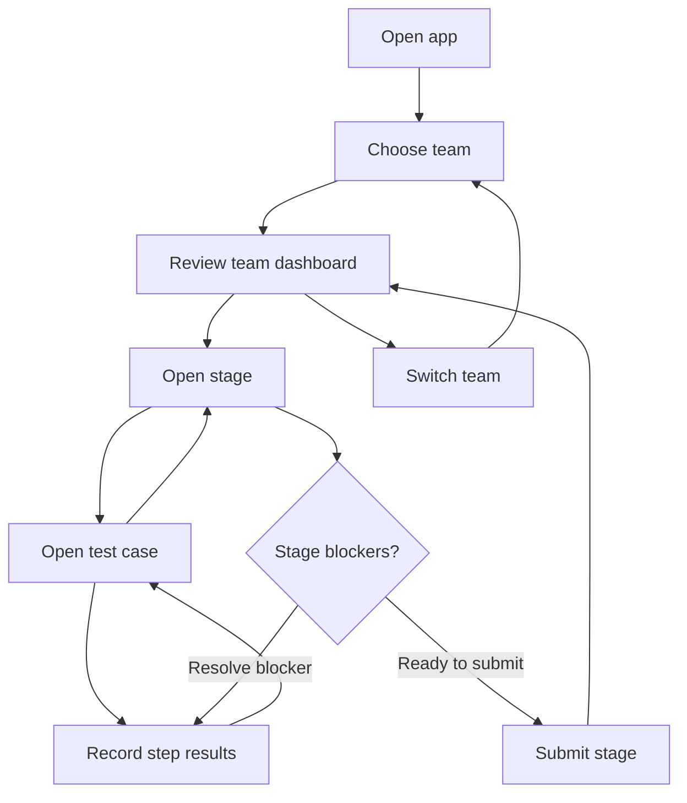

# System Map: Judge Inspection Flow

This document maps the judge-facing inspection journey first, then summarizes the
SwiftUI coordinator wiring that supports it. App source root:
`FSAECertification/FSAEInspectionChecklist/FSAEInspectionChecklist/` (all
repo-relative paths below are relative to this root unless prefixed).

## User Flow Overview

A judge launches the app, selects or resumes a team session, reviews the active
team dashboard, works through inspection stages, records test-step outcomes,
resolves validation blockers, and submits stage snapshots. During an event, the
judge can switch teams and return to the same flow for the next active session.

Primary path:

1. Launch app.
2. Select or resume a team session.
3. Review team progress and open blockers.
4. Open an inspection stage.
5. Open a test case.
6. Record individual step outcomes, measurements, evidence, and notes.
7. Resolve blockers until the stage can be submitted.
8. Submit the stage snapshot.
9. Continue another stage or switch teams.

## Judge Flow Diagram

## Screen Responsibilities

| User goal | Screen | What the judge can do |
| --- | --- | --- |
| Pick inspection work | SessionSelectorView (Sessions tab) | Select or resume a team session; blocked teams stay on the roster. |
| Understand team progress | ActiveTeamDashboardView (Team tab) | Review stage status, open blockers, continue a stage, or start team switching. |
| Work a stage | FullStageView (Stage tab) | Open test cases, review validation blockers, and submit when validation passes. |
| Complete a case | TestCaseView (Case tab) | Edit all step outcomes, notes, measurements, and evidence for a test case. |
| Focus one step | StepOverviewView (Step tab) | Record a single step result, then return to the case or stage flow. |
| Switch active team | TeamSwitchConfirmationView (sheet) | Confirm save-and-switch or cancel back to the dashboard. |

## Current Gaps

- `FullStageView` renders a **Submit Stage** button gated by draft-backed
  validation (`FullStageViewState.canSubmit`), but the `submitStage` closure wired
  in `ContentTabsView` is currently an empty no-op.
- Recheck and sticker eligibility screens are specified in
  `openspec/changes/technical-inspection-event-development-plan/design.md` but are
  not implemented in navigation yet.
- Validation is not a separate screen: it renders inline as
  `FullStageValidationPanel` and `TestCaseValidationSummaryPanel`, then deep-links
  blockers to the relevant step.

## Implementation Map

The app is a single-window SwiftUI app (`FSAEInspectionChecklistApp` ->
`ContentView`) whose root UI is a five-tab `TabView` (`ContentTabsView`):
**Sessions**, **Team**, **Stage**, **Case**, **Step**. Each tab wraps its screen in
its own `NavigationStack`, but there is currently no push navigation inside a tab.
Flow-driven transitions are programmatic tab switches backed by coordinator state.

Navigation is owned by a three-level coordinator hierarchy (MVC + Coordinators,
per the development plan design):

1. **`AppCoordinator`** (root) holds `route: AppCoordinatorRoute` (`.login` /
   `.sessionSelector` / `.inspection`) and `selectedScreen: ProposedScreen`
   (`.sessionSelector` / `.dashboard` / `.stageChecklist` / `.testCase` /
   `.stepDetail`). `selectedScreen` is bound to the `TabView` selection via
   `ContentViewBindings.selectedScreenBinding`, so setting it changes the visible
   screen. Login is mocked: `ContentView.task` calls `completeMockLogin()` on
   launch and then loads official stages through `InspectionContentService`,
   falling back to `MockInspectionData`.
2. **`InspectionEventCoordinator`** scopes the inspection event: it owns a
   `SessionSelectionCoordinator` and creates a fresh
   **`InspectionExecutionCoordinator`** whenever a session is started or resumed,
   restoring persisted drafts from the `InspectionEventStore`.
3. **`InspectionExecutionCoordinator`** holds the in-session position as
   `route: InspectionExecutionRoute` (`.dashboard`, `.stage`, `.testCase`,
   `.testStep`, `.teamSwitchConfirmation`) plus draft state
   (`draftsByTestCaseID`). Views call closures that funnel into `AppCoordinator`
   methods such as `openStage`, `openTestCase`, `openTestStep`, `saveStepDraft`,
   and `requestTeamSwitch`.

State-driven presentation: tabs whose coordinator state is missing (no execution
coordinator, no active stage/test case) render an `EmptyFlowState` placeholder
instead of their screen. The team-switch confirmation is the one modal in the app:
a `.sheet` on `ContentView` whose `isPresented` binding derives from
`route == .teamSwitchConfirmation` (`ContentViewBindings.teamSwitchConfirmationBinding`,
medium detent).

## Screen Inventory

| Screen | Owning coordinator | Source file (repo-relative) | Purpose |
| --- | --- | --- | --- |
| ContentTabsView (root tabs) | `AppCoordinator` | `FSAECertification/FSAEInspectionChecklist/FSAEInspectionChecklist/App/ContentTabsView.swift` | Root five-tab `TabView`; binds tab selection to `AppCoordinator.selectedScreen` and injects coordinators/closures into each screen. |
| SessionSelectorView (SC-001) | `SessionSelectionCoordinator` | `FSAECertification/FSAEInspectionChecklist/FSAEInspectionChecklist/Features/SessionFlow/Views/SessionSelectorView.swift` | Judge-facing team roster with resume status; tapping a team starts or resumes its inspection session. |
| ActiveTeamDashboardView (SC-002) | `InspectionExecutionCoordinator` | `FSAECertification/FSAEInspectionChecklist/FSAEInspectionChecklist/Features/SessionFlow/Views/ActiveTeamDashboardView.swift` | Active team context: overall progress, open blockers, draft-backed per-stage status rows, open-stage and switch-team actions. |
| FullStageView (SC-003 Stage) | `InspectionExecutionCoordinator` (via `AppCoordinator` closures) | `FSAECertification/FSAEInspectionChecklist/FSAEInspectionChecklist/Features/StageExecution/Views/FullStageView.swift` | Ordered sections and test cases for the active stage, stage validation panel with blocker deep-links, and the validation-gated Submit Stage control. |
| TestCaseView (SC-003 Test Case) | `InspectionExecutionCoordinator` (via `AppCoordinator` closures) | `FSAECertification/FSAEInspectionChecklist/FSAEInspectionChecklist/Features/TestCaseExecution/Views/TestCaseView.swift` | All steps of the active test case as editable cards (outcome, notes, measurement, evidence) with validation summary; autosaves drafts per edit. |
| StepOverviewView (SC-004/005/006) | `InspectionExecutionCoordinator` | `FSAECertification/FSAEInspectionChecklist/FSAEInspectionChecklist/Features/TestStepExecution/Views/StepOverviewView.swift` | Single-step detail: outcome picker, measurement input with range help, notes editor, evidence metadata; Done returns to the Stage tab. |
| TeamSwitchConfirmationView (SC-007) | `InspectionExecutionCoordinator` | `FSAECertification/FSAEInspectionChecklist/FSAEInspectionChecklist/Features/SessionFlow/Views/TeamSwitchConfirmationView.swift` | Sheet confirming save-and-switch to another team when a session is active; Cancel returns to the dashboard route. |

Supporting (non-screen) navigation files: `App/ContentView.swift` (root view, mock login, content loading, switch sheet host), `App/ContentViewBindings.swift` (SwiftUI bindings bridging coordinator state to `TabView`/sheet), `App/ProposedScreen.swift`, `Features/SessionFlow/Coordinators/AppCoordinatorRoute.swift`, and `Features/SessionFlow/Coordinators/InspectionExecutionRoute.swift` (route enums).
