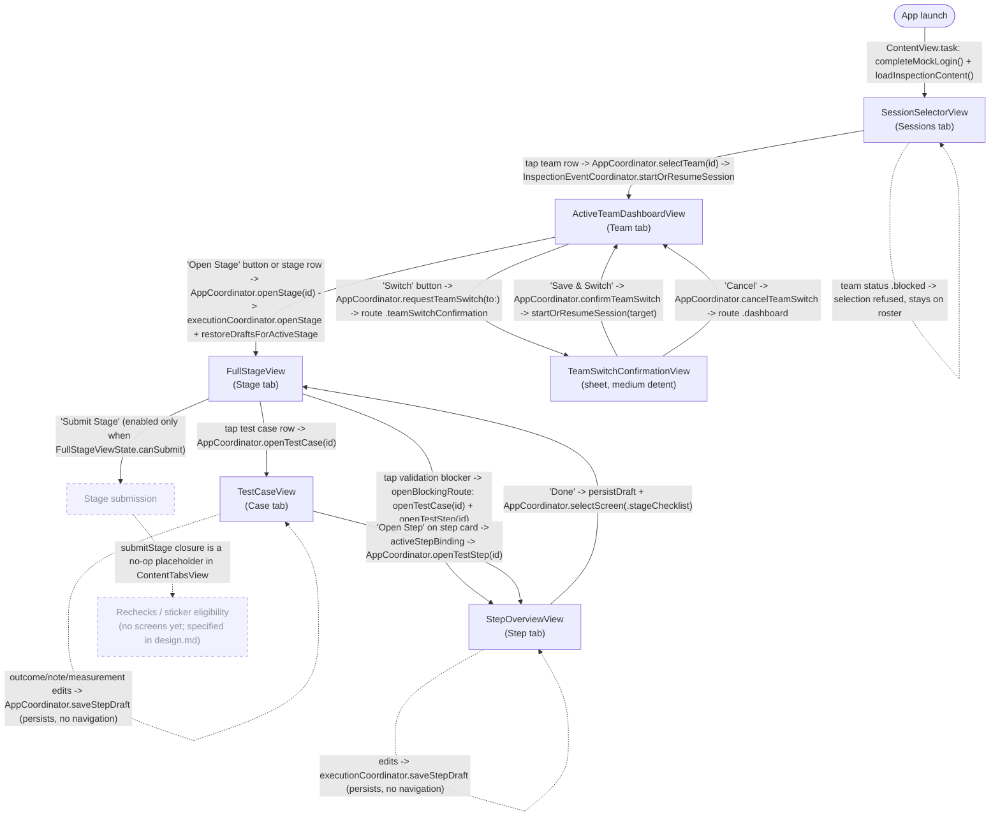

# System Map: iOS App Navigation Flow

This document describes the navigation architecture of the FSAE Inspection Checklist iOS app as it exists today. App source root: `FSAECertification/FSAEInspectionChecklist/FSAEInspectionChecklist/` (all repo-relative paths below are relative to this root unless prefixed).

## Navigation Architecture Overview

The app is a single-window SwiftUI app (`FSAEInspectionChecklistApp` -> `ContentView`) whose root UI is a five-tab `TabView` (`ContentTabsView`): **Sessions**, **Team**, **Stage**, **Case**, **Step**. Each tab wraps its screen in its own `NavigationStack`, but there is currently no push navigation inside any tab — every screen-to-screen transition is a *programmatic tab switch* driven by coordinator state.

Navigation is owned by a three-level coordinator hierarchy (MVC + Coordinators, per the development plan design):

1. **`AppCoordinator`** (root) holds `route: AppCoordinatorRoute` (`.login` / `.sessionSelector` / `.inspection`) and `selectedScreen: ProposedScreen` (`.sessionSelector` / `.dashboard` / `.stageChecklist` / `.testCase` / `.stepDetail`). `selectedScreen` is bound to the `TabView` selection via `ContentViewBindings.selectedScreenBinding`, so setting it *is* the navigation act. Login is mocked: `ContentView.task` calls `completeMockLogin()` on launch (there is no login screen; `.login` is only the initial route value) and then loads official stages through `InspectionContentService`, falling back to `MockInspectionData`.
2. **`InspectionEventCoordinator`** scopes the inspection event: it owns a `SessionSelectionCoordinator` (team roster, start/resume/blocked intents) and creates a fresh **`InspectionExecutionCoordinator`** whenever a session is started or resumed (`startOrResumeSession`), restoring persisted drafts from the `InspectionEventStore`.
3. **`InspectionExecutionCoordinator`** holds the in-session position as `route: InspectionExecutionRoute` (`.dashboard`, `.stage`, `.testCase`, `.testStep`, `.teamSwitchConfirmation`) plus the draft state (`draftsByTestCaseID`). Views never mutate routes directly; they call closures that funnel into `AppCoordinator` methods (`openStage`, `openTestCase`, `openTestStep`, `saveStepDraft`, `requestTeamSwitch`), which update the execution route *and* the selected tab together.

State-driven presentation: tabs whose coordinator state is missing (no execution coordinator, no active stage/test case) render an `EmptyFlowState` placeholder instead of their screen. The team-switch confirmation is the one modal in the app — a `.sheet` on `ContentView` whose `isPresented` binding derives from `route == .teamSwitchConfirmation` (`ContentViewBindings.teamSwitchConfirmationBinding`, medium detent).

Submission, rechecks, and stickers: `FullStageView` renders a **Submit Stage** button gated by draft-backed validation (`FullStageViewState.canSubmit`), and its validation panel deep-links each blocker to the offending test step. However, the `submitStage` closure wired in `ContentTabsView` is currently an empty no-op, and no recheck or sticker screens exist yet — those flows are specified in `openspec/changes/technical-inspection-event-development-plan/design.md` but not implemented in navigation.

## Navigation Flow

Notes:

- Any tab can also be reached directly through the tab bar (`selectedScreenBinding`); the coordinator methods above are the flow-driven paths.
- Stage, Case, and Step tabs show an `EmptyFlowState` placeholder until the corresponding coordinator state exists (active session / stage / test case).
- Validation is not a separate screen: it renders inline as `FullStageValidationPanel` (stage level) and `TestCaseValidationSummaryPanel` (test case level), gating the submit control and deep-linking blockers to steps.

## Screen Inventory

| Screen | Owning coordinator | Source file (repo-relative) | Purpose |
| --- | --- | --- | --- |
| ContentTabsView (root tabs) | `AppCoordinator` | `FSAECertification/FSAEInspectionChecklist/FSAEInspectionChecklist/App/ContentTabsView.swift` | Root five-tab `TabView`; binds tab selection to `AppCoordinator.selectedScreen` and injects coordinators/closures into each screen. |
| SessionSelectorView (SC-001) | `SessionSelectionCoordinator` | `FSAECertification/FSAEInspectionChecklist/FSAEInspectionChecklist/Features/SessionFlow/Views/SessionSelectorView.swift` | Judge-facing team roster with resume status; tapping a team starts or resumes its inspection session. |
| ActiveTeamDashboardView (SC-002) | `InspectionExecutionCoordinator` | `FSAECertification/FSAEInspectionChecklist/FSAEInspectionChecklist/Features/SessionFlow/Views/ActiveTeamDashboardView.swift` | Active team context: overall progress, open blockers, draft-backed per-stage status rows, open-stage and switch-team actions. |
| FullStageView (SC-003 Stage) | `InspectionExecutionCoordinator` (via `AppCoordinator` closures) | `FSAECertification/FSAEInspectionChecklist/FSAEInspectionChecklist/Features/StageExecution/Views/FullStageView.swift` | Ordered sections and test cases for the active stage, stage validation panel with blocker deep-links, and the validation-gated Submit Stage control. |
| TestCaseView (SC-003 Test Case) | `InspectionExecutionCoordinator` (via `AppCoordinator` closures) | `FSAECertification/FSAEInspectionChecklist/FSAEInspectionChecklist/Features/TestCaseExecution/Views/TestCaseView.swift` | All steps of the active test case as editable cards (outcome, notes, measurement, evidence) with validation summary; autosaves drafts per edit. |
| StepOverviewView (SC-004/005/006) | `InspectionExecutionCoordinator` | `FSAECertification/FSAEInspectionChecklist/FSAEInspectionChecklist/Features/TestStepExecution/Views/StepOverviewView.swift` | Single-step detail: outcome picker, measurement input with range help, notes editor, evidence metadata; Done returns to the Stage tab. |
| TeamSwitchConfirmationView (SC-007) | `InspectionExecutionCoordinator` | `FSAECertification/FSAEInspectionChecklist/FSAEInspectionChecklist/Features/SessionFlow/Views/TeamSwitchConfirmationView.swift` | Sheet confirming save-and-switch to another team when a session is active; Cancel returns to the dashboard route. |

Supporting (non-screen) navigation files: `App/ContentView.swift` (root view, mock login, content loading, switch sheet host), `App/ContentViewBindings.swift` (SwiftUI bindings bridging coordinator state to `TabView`/sheet), `App/ProposedScreen.swift`, `Features/SessionFlow/Coordinators/AppCoordinatorRoute.swift`, and `Features/SessionFlow/Coordinators/InspectionExecutionRoute.swift` (route enums).
